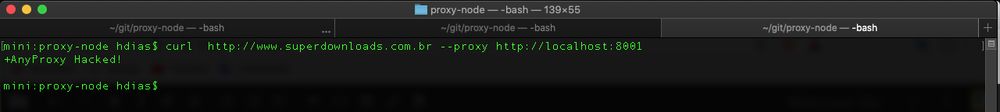

# Anyproxy test

Testing the tool anyproxy.

## Requiriments

1. [Node + Npm](https://nodejs.org/en/download/)
2. [Anyproxy](https://anyproxy.io/en/#install)

## Setup
```sh
$ git clone https://github.com/stdioh321/proxy-node.git
$ cd proxy-node
$ npm install
$ npm install -g anyproxy
```
## Setup HTTPS
```sh
$ anyproxy-ca
$ cd ~/.anyproxy/certificates/
```
> At your home directory in the folder **.anyproxy/certificates** will be generated two certifications files: rootCA.crt and rootCA.key.

> Follow the guide to install the certification at your machine: [https://anyproxy.io/en/#config-root-ca-in-osx](https://anyproxy.io/en/#config-root-ca-in-osx)

> After the certification been install, you can allow the proxy to get https requests.
> At the file proxy.js change
`forceProxyHttps: false` to `forceProxyHttps: true` 

## How to run
```sh
$ node proxy.js
```
* The proxy server will run at the port **8001.**
* Setup your OS proxy to use the host  and port **127.0.0.1:8001**

## Testing
```sh
$ curl http://www.superdownloads.com.br --proxy 127.0.0.1:8001
```



## References
1. [AnyProxy](https://anyproxy.io/)
2. [Curl](https://curl.haxx.se/download.html)